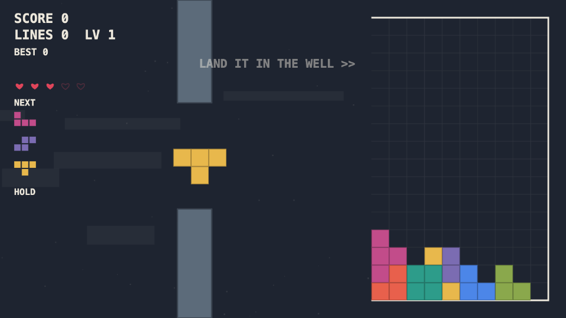

# Flapstack

Flappy-bird flight physics meets a falling-block stacking well. Flap a
four-block piece through the pipes, then land it in the well: full rows clear,
clears win hearts back, and the stack rises to meet you.

One file, zero dependencies, Canvas 2D. Open it and play.

## Play

- **Local:** open `index.html` in any desktop browser (double-click works, no server needed).
- **Live:** https://rboundi.github.io/flapstack/ (GitHub Pages, once the repo is public).

## Controls

| Key | Action |
| --- | --- |
| Space / Click | Flap |
| R or Up | Rotate piece (with wall kicks) |
| Down | Dive |
| Shift or H | Hold / swap piece (once per flight) |
| P | Pause / resume (3-2-1 countdown) |
| Esc | End run / close panel |
| D | Switch mode (between runs) |
| 1-5 | Replay a recent run by seed |
| M / N | Sound / music on-off |
| - / = | Volume |
| C | Letter overlay on blocks (colorblind aid) |
| S / X | Copy shareable result text / PNG result card (game over) |
| G | Ghost racer on-off |
| [ / ] | Practice speed (zen only) |
| B | Badge gallery |
| ? | Help overlay with this key map |
| T | Live tuning panel (dev) |
| Gamepad | A flap, B/X rotate, Y hold, down dive, Start pause |

Press `?` in the game for the same list.

## Modes

- **Free** - endless flight with ramping scroll speed, shrinking and drifting
  pipe gaps, a second pipe, and rising garbage rows.
- **Daily** - one seeded run per calendar date, same for everyone, with its own
  best score and a day streak.
- **Zen** - no pipes, no game over. Top-out sweeps the well and play continues.
- **Sprint** - race to 10 lines, best time recorded.
- **Attack** - best score in 2:00.
- **Seed** - open `index.html#seed=12345` to replay any exact run. Every game
  over screen and shared result includes its seed.
- **Ghost race** - replaying a seed you have played before (daily included)
  spawns your best attempt as a translucent racer flying its recorded path.

## Details

- 3 hearts to start (max 5); crashes cost one, every cleared row restores one.
  Topping out ends the run regardless.
- Scoring: pipe pass +10 (+5 clean through the middle of the gap), lock +5,
  precision landing +10, lines 100/250/450/700 with a combo multiplier up to
  x3, all clear +500.
- Wall and stack side contact inside the well settles the piece down into
  place instead of killing you; the well ceiling bumps instead of killing.
- WebAudio synth for all sound and generative music - no asset files.
- Idle on the title screen long enough and the game starts demoing itself.
- Persistent (localStorage): bests per mode, daily bests and streak, badges,
  ghost recordings, lifetime stats, last five runs, sound/music/volume/letter
  preferences.
- Installable (inline web app manifest); respects `prefers-reduced-motion`
  (no shake, debris, trails, drift, or attract demo).

## Development

The whole game is `index.html` - inline CSS and JS, no build step.

- **Test suite:** open `index.html?test=1` to run the in-page regression suite
  (44 tests: physics, scoring, modes, input, stability). Results render in a
  panel and in `window.__testResults`. Storage and constants are snapshotted
  and restored.
- **Tuning panel:** press `T` for live sliders over the feel constants
  (gravity, flap, scroll, gaps, rise cadence, ...), with a copy-diff button
  that emits ready-to-paste `CONFIG` lines.
- **QA surface:** `window.__game` exposes state, grid, score, lock events, and
  deterministic helpers (`step(dt)`, `setPiece`, `debugFillRow`, ...) for
  driving the game from scripts.

All tunables live in the `CONFIG` object at the top of the script. The build
version shown on the title screen is the `VERSION` const next to it.

Spec and design history: [prompts/P1c-flapstack-mvp.md](prompts/P1c-flapstack-mvp.md).
